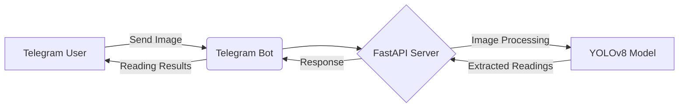

## ⚖️ Utility Meter Reading Recognition Project

### Overview
This project aims to automate the process of utility meter (water, gas, electricity) reading using advanced computer vision and machine learning techniques. The core technologies include FastAPI, YOLOv8, and a Telegram Bot (AIOGram) running in a Docker container on Linux Manjaro with an NVidia RTX 3090 Ti GPU.

### System Architecture


### Features
- Image submission via Telegram Bot.
- Real-time processing with YOLOv8 for accurate meter reading.
- Fast and scalable backend with FastAPI.
- High-performance computing with NVidia RTX 3090 Ti.

### Prerequisites
- Docker
- Linux Manjaro
- NVidia GPU support

### Installation
1. Clone the repository:
   ```
   git clone [repository-url]
   ```
2. Navigate to the project directory:
   ```
   cd utility-meter-reading-recognition
   ```
3. Build the Docker container:
   ```
   docker build -t utility-meter-reading .
   ```

### Usage
1. Start the Docker container:
   ```
   docker run --gpus all -p 80:80 utility-meter-reading
   ```
2. Interact with the Telegram Bot by sending images of utility meters.

---


---

### Contributing
Contributions to this project are welcome! Please fork the repository and submit pull requests with your enhancements.

### License
This project is licensed under the [MIT License](LICENSE).

### Contact
For any inquiries, please contact [project-email].

---

